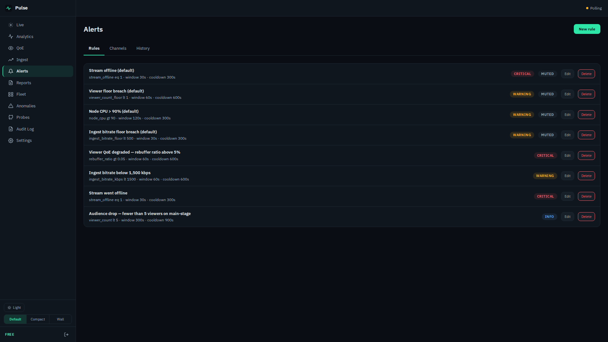
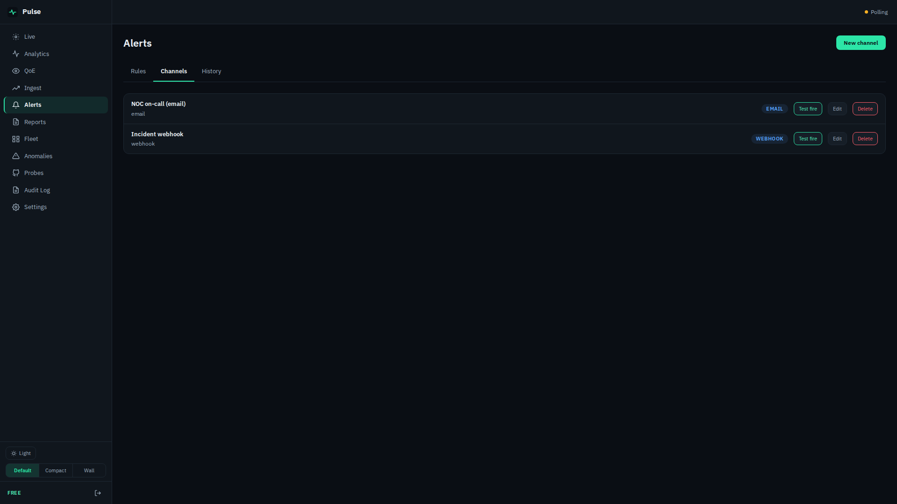
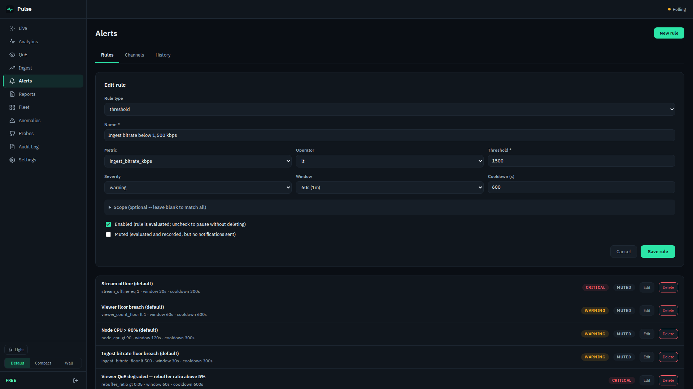
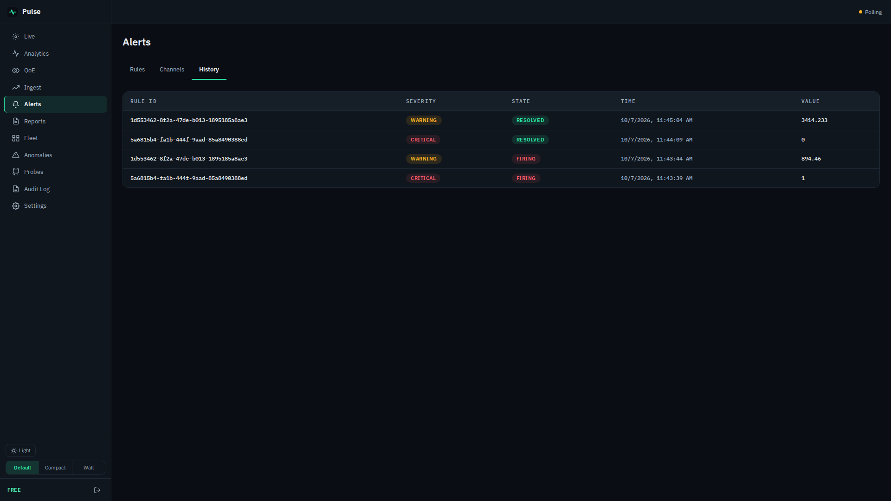
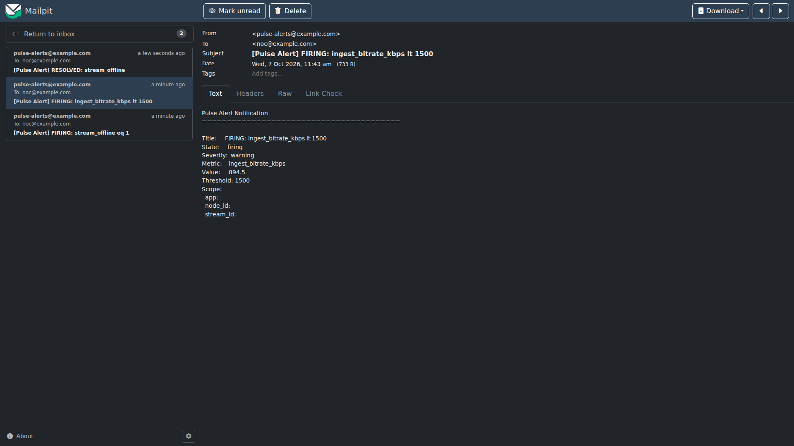

# Pulse — Alert Configuration and Usage

Pulse evaluates alert rules every **5 seconds** against live data from your Ant Media Server
(and, for QoE rules, beacon data in ClickHouse). It notifies **e-mail, Slack, Telegram,
PagerDuty or a signed webhook**, and records every firing and resolution in **Alerts → History**.

## 1. What you get out of the box — and what you must add

A new install seeds four rules — *Stream offline*, *Viewer floor breach*, *Node CPU > 90%*,
*Ingest bitrate floor breach*. They are **enabled but muted**, and **no notification channel
exists**. Pulse records these alerts in History but **notifies nobody** until you:

1. create at least one channel (**Alerts → Channels → New channel**), and
2. edit a rule (**Alerts → Rules → Edit**), tick the channel under **Notify channels**, and
   un-mute it. The Rules list shows each rule's channels — **No channel** means the rule
   records history but notifies nobody.



## 2. Channels

| Type | Configure |
|---|---|
| E-mail (SMTP) | UI or API: recipient, SMTP server (`host:port`), sender, login, STARTTLS. Login stored encrypted. |
| Slack (incoming webhook) | UI or API. The webhook URL is stored encrypted. |
| Telegram (bot) | UI or API. Bot token stored encrypted. |
| PagerDuty (Events v2) | UI or API. Routing key stored encrypted. |
| Webhook (JSON + HMAC-SHA256) | UI or API. Signed with `X-Pulse-Signature: sha256=<hex>`. |

Each channel has a **Test fire** button that sends a sample notification.



**E-mail needs an SMTP server.** Without one Pulse tries `localhost:587` — in the container,
the container itself — so set it in the channel form or through the API:

```sh
curl -s -X POST http://<pulse>:8090/api/v1/alerts/channels \
  -H "Authorization: Bearer $PULSE_TOKEN" -H "Content-Type: application/json" \
  -d '{"type":"email","name":"NOC on-call",
       "config":{"email_to":"noc@example.com","smtp_addr":"smtp.example.com:587",
                 "from":"pulse-alerts@example.com","username":"alerts@example.com",
                 "password":"<smtp-password>","starttls":true}}'
```

Secrets (SMTP login, webhook and bot tokens, routing keys, the signing secret) are never shown
again. When you edit a channel — in the UI or with `PUT /api/v1/alerts/channels/{id}` — a
secret you leave out is kept. A config the channel type cannot use (a missing URL, a wrong
key name, an SMTP server without a port) is refused when you save it, not at the first alert.

## 3. Rules

| Field | Meaning |
|---|---|
| Metric | What is measured (table below). |
| Operator / threshold | `gt`, `lt`, `gte`, `lte`, `eq` against a number. |
| Window | How long the condition must hold before the alert fires (60 s – 1 h presets). |
| Severity | `info`, `warning`, `critical` — shown in notifications and history. |
| Cooldown | Minimum time between repeated notifications for the same alert. |
| Scope | Optional: limit to one application, stream, node or tenant. Empty = everything. |
| Enabled / Muted | Disabled = not evaluated. Muted = evaluated and recorded, but nobody is notified. |
| Notify channels | The channels the rule sends to. None = recorded in History, nobody notified. |
| Maintenance windows | Recurring quiet periods, e.g. Sundays 02:00–03:00 UTC (`maintenance_windows`, set through the API; the form lists them). |
| Rule type `anomaly` | Instead of a threshold, fire when a metric deviates σ standard deviations from its learned baseline. |



| Metric | Source | Typical rule |
|---|---|---|
| `stream_offline` | Live AMS poll | `eq 1`, window 30 s — see §5 for how wildcard rules resolve |
| `ingest_bitrate_kbps` | Live AMS poll | `lt 1500`, window 60 s |
| `viewer_count` / `viewer_count_floor` | Live AMS poll | `lt 5` on a key stream |
| `health_score` | Live ingest health (0–100) | `lt 60` |
| `packet_loss_pct`, `jitter_ms`, `rtt_ms` | Live AMS poll (WebRTC stats) | `gt 2` (%) |
| `cpu_pct`, `mem_pct` (`node_cpu`, `node_mem`, `node_disk`) | AMS system resources | `gt 90` |
| `node_degraded`, `node_down` | Node health ladder | `eq 1` |
| `rebuffer_ratio`, `error_rate` | Beacon QoE (hourly rollup) | see the limitation in §6 |

## 4. What a notification looks like

From the 2026-10-07 demo run (a real Pulse v0.5.0 build; the AMS was simulated): the encoder
feeding stream `studio-b` dropped from about 3.4 Mbps to under 1,000 kbps.

| Time (UTC) | Event |
|---|---|
| 11:42:38 | Encoder bitrate starts to drop |
| 11:43:44.104 | Rule *Ingest bitrate below 1,500 kbps* fires (value 894.46 kbps; 60 s window) |
| 11:43:44.711 | E-mail delivered to the on-call inbox |
| 11:43:44 | Signed webhook received (`X-Pulse-Signature` present) |
| 11:44:57 | Encoder recovers |
| 11:45:04 | Alert resolves; *RESOLVED* e-mail (11:45:05.3) and webhook delivered |





The e-mail subject is `[Pulse Alert] FIRING: <metric> <operator> <threshold>`. The body lists
state, severity, metric, value, threshold and the **rule's** scope. Webhook payload (abridged):

```json
{"version":1,"state":"firing","severity":"warning","metric":"ingest_bitrate_kbps",
 "value":894.46,"threshold":1500,"group_key":"studio-b",
 "title":"FIRING: ingest_bitrate_kbps lt 1500","ts":1791373424104,"test":false}
```

Verify the signature on your receiver: `HMAC-SHA256(webhook_secret, raw_body)`, hex-encoded,
compared in constant time with the `sha256=` value of `X-Pulse-Signature`.

## 5. Behaviour worth knowing

- **Which stream?** For rules that cover all streams, the e-mail does not name the affected
  stream (its "Scope" lines are the rule's, which are empty), and the History tab lists the
  rule by ID. The webhook carries the stream in `group_key`. Until this is improved, scope
  critical rules to specific streams or applications, or route alerts through the webhook.
- **Wildcard `stream_offline` is edge-triggered.** A rule with no stream scope fires once when
  a stream disappears and sends *RESOLVED* shortly afterwards (≈25 s in the demo) even if the
  stream stays down. For a stream that must stay up, create a rule scoped to that stream —
  it stays firing until the stream returns.
- **Health score is lenient.** In the demo, a stream at 45 % of its target bitrate still scored
  81/100 ("healthy"). Alert on `ingest_bitrate_kbps` for encoder drops rather than on the
  score.
- **Cooldown** suppresses repeat notifications only; History still records state changes.

## 6. Known limitation — QoE rebuffer/error rules

`rebuffer_ratio` and `error_rate` rules read the hourly QoE rollup. The 2026-10-01 audit found
that this rollup **under-reports** both ratios for real SDK traffic (rebuffer ratio by roughly
(heartbeats + 1) ÷ 2 per session — about 10× for a 10-minute view). In the demo, a stream
whose synthetic viewers rebuffered about 8 % of the time never crossed a 5 % rule. Do not rely
on these two rule types until the fix ships; use probes and ingest rules instead. Details:
[LIM-30](https://github.com/aytekXR/ams-pulse/blob/main/docs/known-limitations.md#lim-30-audience-analytics-usage-viewer-minutes-and-qoe-ratios-are-wrong-for-player-sdk-sessions) in the known-limitations list.

## 7. API quick reference

| Action | Call |
|---|---|
| List / create rules | `GET` / `POST /api/v1/alerts/rules` |
| Update / delete a rule | `PUT` / `DELETE /api/v1/alerts/rules/{id}` |
| List / create channels | `GET` / `POST /api/v1/alerts/channels` |
| Test a channel | `POST /api/v1/alerts/channels/{id}/test` |
| History | `GET /api/v1/alerts/history` |

All calls take `Authorization: Bearer <admin token>`. Full reference: `docs/runbooks/alerting.md`
and `contracts/openapi/pulse-api.yaml` in the repository.
