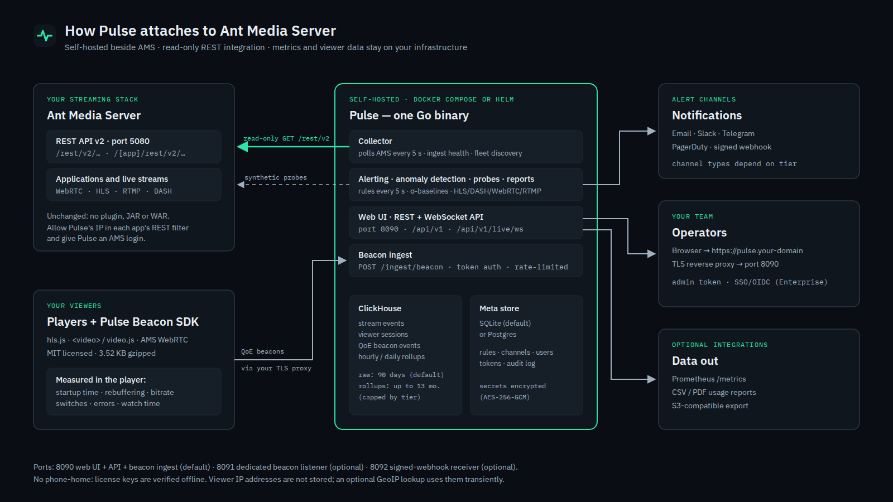

# Pulse — Architecture Overview

*(Vector: `assets/diagrams/pulse-architecture.svg`; 2× PNG: `pulse-architecture@2x.png`.)*

## Components

| Component | What it does |
|---|---|
| **Collector** | Polls the AMS REST v2 API every 5 s (applications, broadcasts, WebRTC client stats, system resources, cluster nodes, VoDs). Keeps live aggregates in memory for the dashboard and writes events to ClickHouse. |
| **Beacon ingest** | `POST /ingest/beacon` — accepts QoE event batches from the player SDK (ingest-token auth, per-token rate limit, 64 KB body cap) and stitches them into viewer sessions. |
| **Alert evaluator** | Evaluates rules every 5 s; delivers to e-mail, Slack, Telegram, PagerDuty and signed webhooks; keeps alert history. |
| **Anomaly detector / prober / report scheduler** | Learns per-metric baselines (Welford σ); runs HLS/DASH/WebRTC/RTMP probes; produces scheduled CSV/PDF reports (optionally to S3). |
| **API + web UI** | One HTTP listener (default `:8090`): React UI, REST API (`/api/v1`), live WebSocket (`/api/v1/live/ws`), `/healthz`, `/metrics`. |
| **ClickHouse** | Time-series store: server events, viewer sessions, QoE events, probe results, hourly/daily rollups. Raw data TTL 90 days by default; rollups 395 days. |
| **Meta store** | SQLite inside the Pulse volume (Postgres optional): rules, channels, tokens, users, tenants, audit log. Secrets encrypted with AES-256-GCM. |

Everything ships as **one Go binary** (`pulse serve | migrate | diag | version`) in a
~75 MB container image, plus ClickHouse. The quickstart runs three containers: ClickHouse, a
one-shot schema migration, and Pulse.

## How Pulse touches AMS

- **Read-only.** Every AMS request is an HTTP GET, except the login that obtains a session
  cookie (`POST /rest/v2/users/authenticate`). Pulse never modifies streams, applications,
  settings or files.
- **Per-application access.** AMS gates each application's REST API by IP
  (`remoteAllowedCIDR`). Pulse must be allowed in each application it should see.
- **Version tolerance.** Unknown JSON fields are ignored and missing ones read as zero; the wire
  format is pinned by tests for AMS 2.10, 2.14, 2.17 and 3.0, checked against real AMS 3.0.3
  captures, and run live against AMS 3.1.0 and 3.0.3.
- **Optional inputs.** Kafka (experimental) and an HMAC-signed webhook receiver. AMS's built-in
  `listenerHookURL` is unsigned and is therefore not accepted.

## Data and privacy

- All data stays on the operator's infrastructure; there is no SaaS component and no
  phone-home.
- **Viewer IP addresses are not stored.** The beacon request IP is used only in memory for an
  optional GeoIP lookup (the operator supplies the MaxMind database), and can be truncated
  first (`PULSE_ANONYMIZE_IP`).
- Admin actions are written to an audit log (`/audit-log`); the admin's request IP is part of
  each audit entry.

## Security posture (summary)

- Container runs as a non-root user; ClickHouse is never published outside the compose network.
- Images: multi-arch, Cosign-signed (keyless, OIDC), SBOM and SLSA provenance; releases are
  blocked by Trivy on fixable HIGH/CRITICAL vulnerabilities; CodeQL and dependency audits run
  in CI.
- API tokens are stored as HMAC-SHA256 hashes; channel secrets and AMS credentials stored by
  Pulse are AES-256-GCM encrypted.
- SSRF guard on everything Pulse dials on an operator's behalf (probes, webhooks, SMTP): cloud
  metadata and link-local addresses are refused.
- Plain HTTP by default — TLS is the operator's reverse proxy (see the installation guide).
