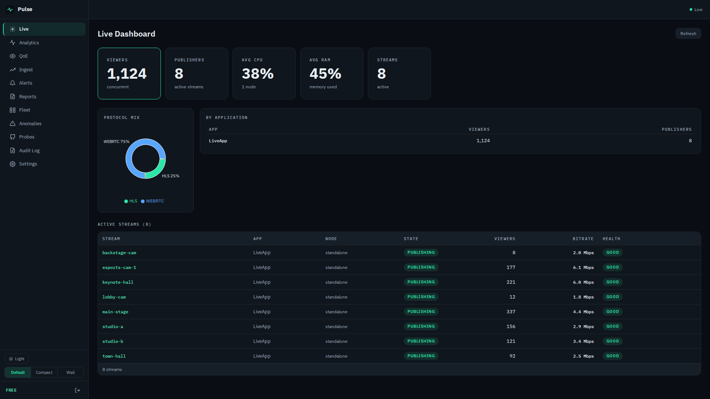

# Pulse — Product Overview

**Pulse** (package `ams-pulse`) is a self-hosted analytics, QoE monitoring and alerting
platform for **Ant Media Server**. It installs next to AMS, reads the AMS REST API, measures
viewer experience with a lightweight player SDK, and tells operators — by e-mail, Slack,
Telegram, PagerDuty or webhook — when something breaks.

## Who it is for

Teams running their own AMS who must answer "is the stream OK, and who is watching?" without
sending viewer data to a third-party SaaS: streaming platforms, e-learning and event
producers, broadcasters and agencies operating AMS for clients.

## What it adds to AMS

The AMS management panel shows the live state of the current server. Pulse adds the
product layer on top of the same REST API: alerting and notification channels, player-side
QoE, retained history, usage reports, synthetic probes and anomaly detection.

| Feature | What it does |
|---|---|
| Live operations dashboard | Streams, viewers by protocol (WebRTC, HLS, RTMP, DASH), ingest bitrate, node CPU/RAM; live WebSocket updates |
| Alerting | Threshold and anomaly rules; e-mail, Slack, Telegram, PagerDuty and signed webhook; mute, cooldown, maintenance windows, history |
| Fleet view | AMS nodes discovered from the cluster API, with CPU and memory |
| Ingest health | 0–100 score per stream; bitrate, FPS, packet loss and jitter timelines |
| Player QoE beacon SDK | 3.5 KB (gzipped), MIT-licensed; startup time, rebuffering, bitrate switches, errors |
| Historical analytics | Audience, geo (with an operator-supplied GeoIP database) and device breakdowns |
| Synthetic probes | Scheduled HLS, DASH, WebRTC and RTMP checks from Pulse's vantage point |
| Data API | Documented REST + WebSocket API (OpenAPI 3.1) |
| Usage reports | Per-stream / per-tenant usage, CSV/PDF, scheduled delivery, S3 export |
| Prometheus | `/metrics` scrape endpoint (bearer-token auth when `PULSE_METRICS_TOKEN` is set) |
| Anomaly detection | Learned baselines on viewers, bitrate, CPU, memory, disk, AMS API latency |
| SSO, white-label reports | OpenID Connect sign-in; branded PDF reports |

**Pulse is free.** Every feature listed above is included on every install, with no node or
retention limits and no license key required. Commercial use is included. The server, web UI
and deploy tooling are licensed under the PolyForm Shield License 1.0.0 (any use including
commercial; the one restriction is providing a competing product); the beacon SDKs are MIT.

## Why operators choose it

- **Nothing to change in AMS** beyond letting Pulse's IP read the REST API: no plugin, no
  restart, no data proxied through Pulse.
- **Self-hosted end to end.** No SaaS, no phone-home; license keys are verified offline.
  Suitable for restricted networks.
- **Installs in minutes.** One command, three containers; the installer checks that Pulse can
  actually reach AMS before declaring success.
- **Honest about its limits.** Known limitations are published (`docs/known-limitations.md`).

## Current limits (abridged)

- HLS viewer counts are AMS's own figure, which counts segment requests and runs high.
- AMS 3.x REST does not report frame rate, so FPS shows 0 and the health score re-weights.
- Geo analytics need a MaxMind GeoLite2 database you download (not bundled).
- Cluster: AMS 3.x does not expose node roles; multi-node operation is not yet validated live.
- The Kafka input is experimental; the Helm chart is experimental.
- **Found in the 2026-10-01 audit, not yet fixed:** audience analytics totals show zero,
  usage-report viewer-minutes are overstated, and QoE rebuffer/error ratios are understated
  for SDK traffic. See [LIM-30](https://github.com/aytekXR/ams-pulse/blob/main/docs/known-limitations.md#lim-30-audience-analytics-usage-viewer-minutes-and-qoe-ratios-are-wrong-for-player-sdk-sessions) in the known-limitations list.

## Versions

Current release **v0.5.0** — `ghcr.io/aytekxr/ams-pulse:0.5.1`, the Helm chart published with v0.5.0.
Validated live on AMS 3.1.0 Enterprise and AMS 3.0.3 Enterprise.
