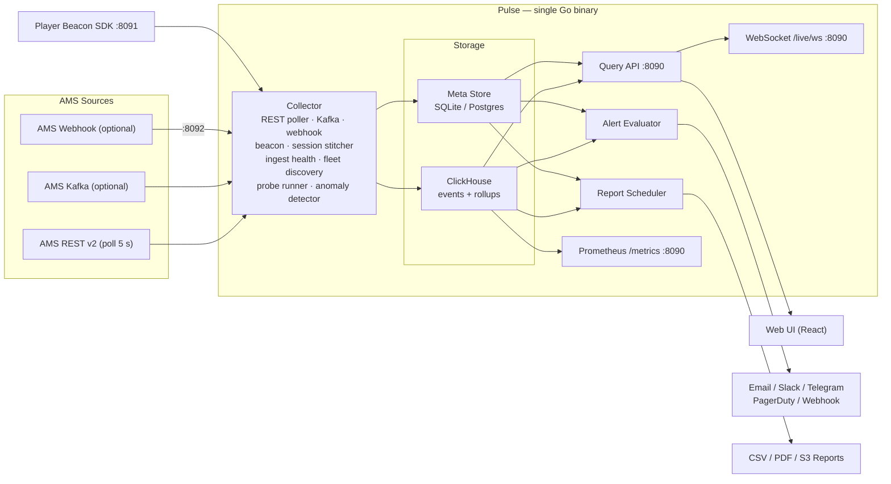
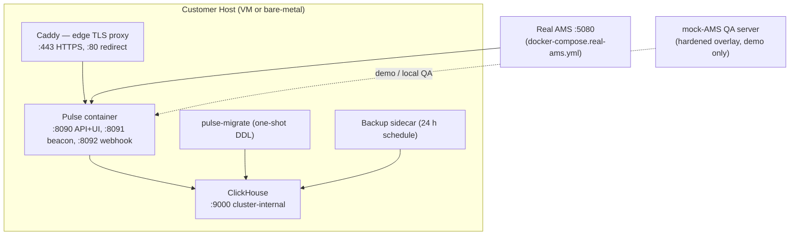
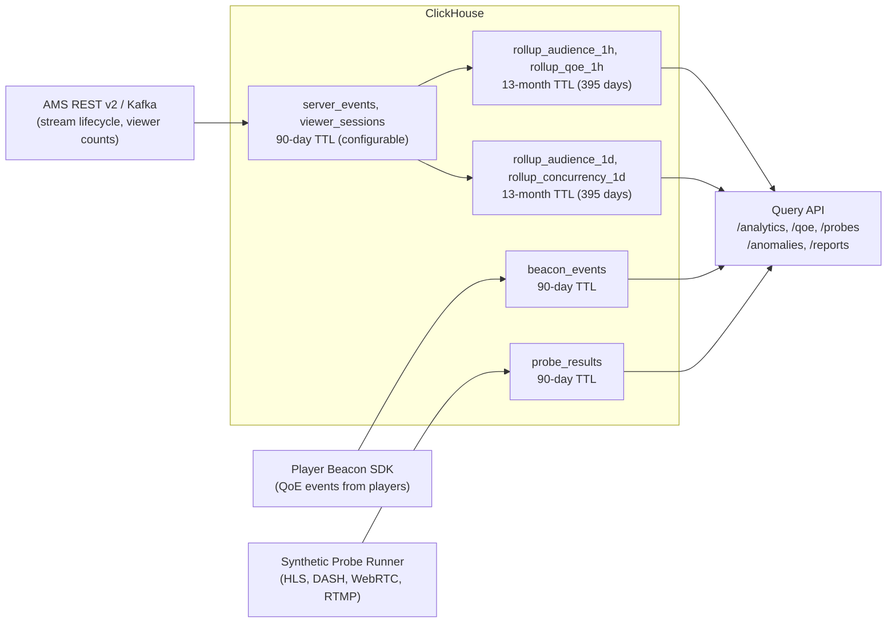

# Pulse — Architecture Overview

_First document for marketplace evaluators and prospective operators._
_For the full technical design see [`docs/ARCHITECTURE.md`](ARCHITECTURE.md).
For the product one-pager see [`docs/product.md`](product.md)._

---

## What Pulse Is

Pulse is a fully self-hosted observability and audience-analytics suite that installs
beside an Ant Media Server (AMS) deployment and answers, out of the box: _who is
watching, where, on what device, with what quality — and is anything broken right now?_
It ships as a single Go binary plus ClickHouse via Docker Compose (or Helm for
Kubernetes) and runs entirely on the customer's own infrastructure. No SaaS, no
telemetry, no phone-home of any kind. Customer data never leaves the host.

Pulse covers the gap that AMS does not fill itself. The new AMS management panel
(panel-reborn, `ant-media/Management-panel-reborn`) charts live server metrics —
per-stream bitrate/viewer history and system-resource trends — but carries no alerting,
no notification channels, no player-side QoE measurement, no long-horizon analytics,
no billing reports, no synthetic probes, and no anomaly detection. Pulse adds exactly
those layers on top of the same AMS backend, without competing with or modifying the
panel. The integration is read-only and upgrade-tolerant: Pulse polls AMS REST v2,
never writes to it, and survives AMS upgrades because it touches no AMS state.

---

## How Pulse Attaches to AMS

Pulse supports four ingest paths, all opt-in at the operator's discretion:

| Path | Direction | Notes |
|---|---|---|
| AMS REST v2 polling | Pulse reads AMS | Primary path; 5 s default poll; never writes to AMS |
| AMS Kafka topic (optional) | AMS publishes, Pulse consumes | Lower-latency stream events; no broker required for REST path |
| AMS Webhook (optional) | AMS pushes, Pulse receives on :8092 | HMAC-SHA256-validated; REST polling covers lifecycle within ≤ 10 s if unsigned |
| Player Beacon SDK (optional) | Player pushes to Pulse :8091 | 3.52 KB gzip MIT JS library; measures startup time, rebuffer rate, bitrate |

AMS credentials are stored encrypted (AES-256-GCM) in the local meta store and never
transmitted externally. The only internet-facing ingest surface is the beacon port
(:8091), which enforces token auth, rate limits, and a 64 KB body cap.

---

## Diagram 1 — System Architecture

The Pulse binary exposes three ports:

- **:8090** — REST API (`/api/v1/*`), WebSocket (`/live/ws`), Prometheus (`/metrics`), health (`/healthz`), and the web UI static bundle.
- **:8091** — Dedicated beacon ingest listener (internet-facing; put a TLS terminator in front).
- **:8092** — Optional webhook receiver (activated when `PULSE_WEBHOOK_SECRET` is set).

---

## Diagram 2 — Deployment Topology

The production stack is composed from five Docker Compose overlays applied in order.
The mock-AMS service (included in the hardened overlay for QA) is suppressed by the
real-AMS overlay when pointing at a live server.

**Five production overlays (apply in this order):**

| Overlay file | Concern |
|---|---|
| `docker-compose.yml` | Base: Pulse + ClickHouse, default env |
| `docker-compose.hardened.yml` | Security caps, resource limits, Caddy TLS, pulse-migrate, mock-AMS for QA |
| `docker-compose.prod-tls.yml` | Production TLS configuration |
| `docker-compose.real-ams.yml` | Disables mock-AMS; wires Pulse to the operator's AMS endpoint |
| `docker-compose.backup.yml` | Backup sidecar (24 h ClickHouse + SQLite snapshots, optional S3 push) |

For local development or QA without a real AMS, omit `docker-compose.real-ams.yml`; the
mock-AMS service from the hardened overlay starts automatically. A Helm chart is also
provided at `deploy/helm/pulse/` for Kubernetes installs.

---

## Diagram 3 — Data Flow and Retention

Raw event rows accumulate with a 90-day TTL (configurable via `PULSE_RETENTION_DAYS`).
Materialized views collapse them into two rollup granularities — 1-hour and 1-day — kept
for 13 months (395 days, configurable via `PULSE_ROLLUP_TTL_DAYS`). The 13-month rollup
queries run in under 150 ms measured against a dimensional GROUP BY (3 geo x 2 device x 2
protocol), well inside the 3 s PRD budget. The live dashboard is served from in-memory
aggregates maintained by the collector, not ClickHouse, so live-ops latency is independent
of query load.

---

## Two-Store Design Rationale

Pulse uses two separate storage backends with a strict no-cross-contamination rule
(see [`docs/adr/0002-storage-clickhouse.md`](adr/0002-storage-clickhouse.md)).
**ClickHouse** holds all events, viewer sessions, QoE beacon events, probe results, and
materialized rollups — the high-volume, append-only, time-series data. TTL-based retention
and materialized-view rollups are native ClickHouse features, so no custom compaction code
is needed. The PRD-mandated ~1–2 GB per million viewer-sessions storage budget is met by
columnar compression; the 13-month query budget demands the columnar engine.

**SQLite** (default) or **Postgres** (opt-in for high-availability installs) holds
configuration and small relational state: alert rules, notification channels, users, API
tokens, report schedules, tenant mappings, probe configurations, and anomaly baselines.
SQLite runs via `modernc.org/sqlite` (pure Go, `CGO_ENABLED=0` enforced throughout),
which means zero additional containers for a small install. Postgres is offered for
operators who already run it and need concurrent meta-store writes. Metrics never go into
the meta store; configuration never goes into ClickHouse. This boundary is enforced at
the architecture level: `pulse migrate` owns all DDL from `contracts/db/` and there is no
ORM that might silently cross it.

---

## License Tiers

Pulse enforces four tiers via ed25519-signed license keys. The Free tier requires no key
and no phone-home; all tiers run fully self-hosted.

| Tier | Max nodes | Retention | Features | Alert channels |
|---|---|---|---|---|
| **Free** | 1 | 7 days | F1 live dashboard, F2 historical analytics, F4 ingest health, F7 fleet view | Email only |
| **Pro** | 10 | 90 days | Free + F3 QoE beacon SDK, F8 data API (REST + WebSocket), F10 synthetic probes | + Slack, Telegram |
| **Business** | 5 | 396 days | Pro + F8 Prometheus `/metrics`, F6 usage/billing reports (CSV/PDF, S3, multi-tenant) | + PagerDuty, Webhook |
| **Enterprise** | Unlimited | Unlimited | Business + F9 anomaly detection (Welford baselines), SSO (OIDC), white-label PDF reports | All five channels |

Max streams is unlimited on every tier. Note that Pro allows up to 10 monitored AMS nodes
while Business allows up to 5 — this intentional pricing distinction reflects product
positioning: Pro targets medium-scale streaming networks needing full API access; Business
targets high-retention reporting and multi-tenant billing use cases. Unlimited nodes require
Enterprise.

License verification is fully offline: the binary verifies the ed25519 signature against
the vendor public key embedded at build time (or supplied via `PULSE_LICENSE_PUBKEY`).
A missing or invalid key falls back to Free tier — the server never refuses to start.
See [`docs/licensing.md`](licensing.md) for minting and activation instructions.

---

## Features F1–F10

| ID | Feature | One-liner |
|---|---|---|
| F1 | Live ops dashboard | Streams, viewers, node health in real time; WebSocket push; new stream visible ≤ 10 s |
| F2 | Historical analytics | Geo and device breakdowns with 13-month rollups; dimensional GROUP BY under 150 ms |
| F3 | Player QoE beacon SDK | 3.52 KB gzip MIT TypeScript library measuring startup time, rebuffer rate, and ABR bitrate |
| F4 | Ingest health | Per-stream 0–100 health score (bitrate, FPS, keyframe interval, loss, jitter); degradation detected in-process in under 250 µs |
| F5 | Alerting | Email/Slack/Telegram/PagerDuty/webhook channels; mute, group-by, maintenance windows; detect→notify measured at 201 ms |
| F6 | Usage/billing reports | Per-tenant CSV and PDF statements with S3 export, ±0.0000% reconciliation drift, true windowed peak concurrency |
| F7 | Cluster fleet view | Auto-discovers origin and edge nodes within 30 s; viewer deduplication across edge/origin roles |
| F8 | Data API and Prometheus | Full public REST and WebSocket API (42 paths, 59 operations); `/metrics` scrape endpoint with bounded cardinality |
| F9 | Anomaly detection | Welford online baselines, σ = 4.0 threshold, 0.259 false alarms/node-week (target < 1); epsilon floor for constant-baseline streams |
| F10 | Synthetic probes | HLS full (TTFB + segment TTFB + bitrate); DASH MPD + segment; WebRTC ICE + RTP stats; RTMP TCP handshake; 4-worker pool, 60 s config refresh |

---

## Documentation Index

| Document | Contents |
|---|---|
| [`docs/runbooks/install.md`](runbooks/install.md) | Step-by-step install: Docker Compose, local binary, Helm (Kubernetes) |
| [`docs/runbooks/productionize.md`](runbooks/productionize.md) | TLS/Caddy, real-AMS wiring, backups, hardened 5-overlay command |
| [`docs/runbooks/alerting.md`](runbooks/alerting.md) | Alert rule semantics, channel setup, maintenance windows, HMAC verification |
| [`docs/runbooks/reports.md`](runbooks/reports.md) | Tenant mapping, egress estimation, schedule setup, S3 export, reconciliation |
| [`docs/runbooks/probes.md`](runbooks/probes.md) | Synthetic probe creation, protocol coverage, result interpretation (F10) |
| [`docs/beacon-sdk.md`](beacon-sdk.md) | Beacon SDK integration for hls.js, video.js, WebRTC, and native video |
| [`docs/guides/prometheus.md`](guides/prometheus.md) | Prometheus scrape configuration, metric reference, Grafana starter panels |
| [`docs/guides/anomaly-detection.md`](guides/anomaly-detection.md) | Welford model, sensitivity calibration, false-alarm math, tuning guide (F9) |
| [`docs/licensing.md`](licensing.md) | Tier entitlements, key minting ceremony, activation methods |
| [`docs/compatibility.md`](compatibility.md) | AMS version matrix, live-validated behaviors, known per-version gaps |
| [`docs/AMS-INTEGRATION.md`](AMS-INTEGRATION.md) | AMS ingest paths, wire-format facts, operator setup against a real AMS |
| [`docs/ARCHITECTURE.md`](ARCHITECTURE.md) | Full component diagram, key boundaries, performance budgets, known issues |
| [`contracts/openapi/pulse-api.yaml`](../contracts/openapi/pulse-api.yaml) | OpenAPI 3.1 specification (42 paths, 59 operations, 73 schemas) |
| [`deploy/helm/pulse/README.md`](../deploy/helm/pulse/README.md) | Helm chart values, secrets setup, HA deployment, resource sizing |

---

_Last updated: D-161 (2026-07-22)._
