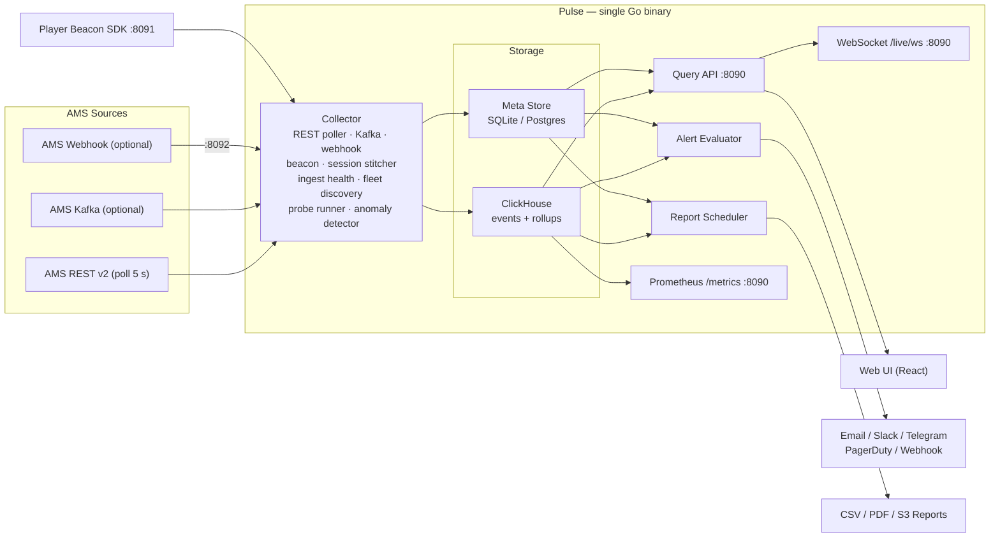
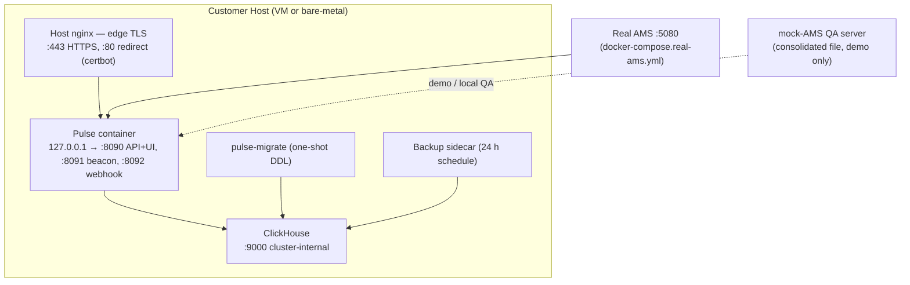
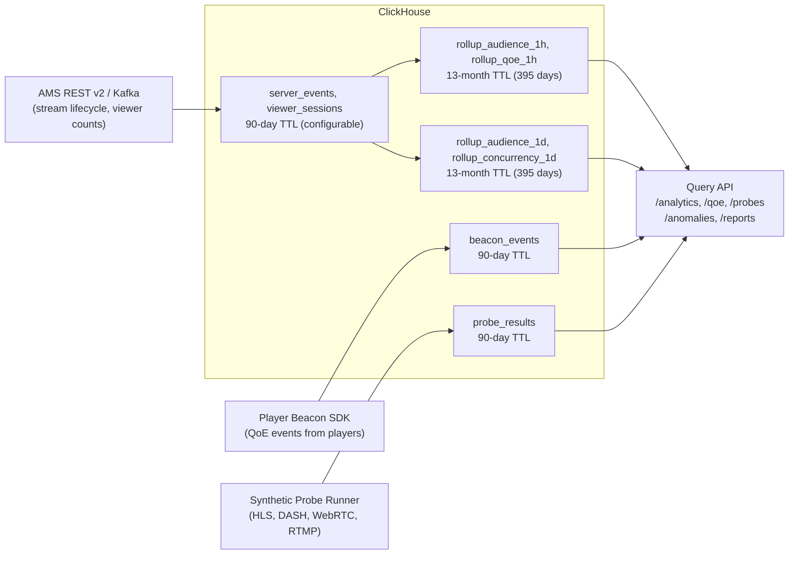

# Pulse — Architecture Overview

_First document for marketplace evaluators and prospective operators._
_For the full technical design see [`docs/ARCHITECTURE.md`](ARCHITECTURE.md).
For the product one-pager see [`docs/product.md`](product.md)._

---

## What Pulse Is

Pulse is a fully self-hosted observability and audience-analytics suite that installs
beside an Ant Media Server (AMS) deployment and answers, out of the box: _who is
watching, where, on what device, with what quality — and is anything broken right now?_
It ships as a single Go binary plus ClickHouse via Docker Compose (or Helm for
Kubernetes) and runs entirely on the customer's own infrastructure. No SaaS, no
telemetry, no phone-home of any kind. Customer data never leaves the host.

Pulse covers the gap that AMS does not fill itself. The new AMS management panel
(panel-reborn, `ant-media/Management-panel-reborn`) charts live server metrics —
per-stream bitrate/viewer history and system-resource trends — but carries no alerting,
no notification channels, no player-side QoE measurement, no long-horizon analytics,
no billing reports, no synthetic probes, and no anomaly detection. Pulse adds exactly
those layers on top of the same AMS backend, without competing with or modifying the
panel. The integration is read-only and upgrade-tolerant: Pulse polls AMS REST v2,
never writes to it, and survives AMS upgrades because it touches no AMS state.

---

## How Pulse Attaches to AMS

Pulse supports four ingest paths, all opt-in at the operator's discretion:

| Path | Direction | Notes |
|---|---|---|
| AMS REST v2 polling | Pulse reads AMS | Primary path; 5 s default poll; never writes to AMS |
| AMS Kafka topic (optional) | AMS publishes, Pulse consumes | Lower-latency stream events; no broker required for REST path |
| AMS Webhook (optional) | AMS pushes, Pulse receives on :8092 | HMAC-SHA256-validated; REST polling covers lifecycle within ≤ 10 s if unsigned |
| Player Beacon SDK (optional) | Player pushes to Pulse :8091 | 3.52 KB gzip MIT JS library; measures startup time, rebuffer rate, bitrate |

AMS credentials are stored encrypted (AES-256-GCM) in the local meta store and never
transmitted externally. The only internet-facing ingest surface is the beacon port
(:8091), which enforces token auth, rate limits, and a 64 KB body cap.

---

## Diagram 1 — System Architecture

```mermaid
flowchart LR
    subgraph SRCS["AMS Sources"]
        AREST["AMS REST v2 (poll 5 s)"]
        AKAFKA["AMS Kafka (optional)"]
        AHOOK["AMS Webhook (optional)"]
    end

    BSDK["Player Beacon SDK :8091"]

    subgraph PB["Pulse — single Go binary"]
        COL["Collector\nREST poller · Kafka · webhook\nbeacon · session stitcher\ningest health · fleet discovery\nprobe runner · anomaly detector"]

        subgraph STR["Storage"]
            CH["ClickHouse\nevents + rollups"]
            META["Meta Store\nSQLite / Postgres"]
        end

        QAPI["Query API :8090"]
        WS["WebSocket /live/ws :8090"]
        EVAL["Alert Evaluator"]
        SCHED["Report Scheduler"]
        PROM["Prometheus /metrics :8090"]
    end

    UI["Web UI (React)"]
    NOTIF["Email / Slack / Telegram\nPagerDuty / Webhook"]
    RPTS["CSV / PDF / S3 Reports"]

    AREST --> COL
    AKAFKA --> COL
    AHOOK -- ":8092" --> COL
    BSDK --> COL
    COL --> CH
    COL --> META
    CH --> QAPI
    META --> QAPI
    QAPI --> WS
    CH --> EVAL
    META --> EVAL
    CH --> SCHED
    META --> SCHED
    CH --> PROM
    QAPI --> UI
    EVAL --> NOTIF
    SCHED --> RPTS
```

The Pulse binary exposes three ports:

- **:8090** — REST API (`/api/v1/*`), WebSocket (`/live/ws`), Prometheus (`/metrics`), health (`/healthz`), and the web UI static bundle.
- **:8091** — Dedicated beacon ingest listener (internet-facing; put a TLS terminator in front).
- **:8092** — Optional webhook receiver (activated when `PULSE_WEBHOOK_SECRET` is set).

---

## Diagram 2 — Deployment Topology

The production stack is a consolidated Docker Compose file plus two overlays. TLS is
terminated by a host-level nginx (reference vhosts in `deploy/nginx/`, certificates via
certbot); the compose stack publishes the app on loopback only. The mock-AMS service
(included in the consolidated file for QA) is suppressed by the real-AMS overlay when
pointing at a live server.

```mermaid
flowchart TB
    subgraph HOST["Customer Host (VM or bare-metal)"]
        NGINX["Host nginx — edge TLS\n:443 HTTPS, :80 redirect (certbot)"]
        PULSE["Pulse container\n127.0.0.1 → :8090 API+UI, :8091 beacon, :8092 webhook"]
        CH2["ClickHouse\n:9000 cluster-internal"]
        MIG["pulse-migrate (one-shot DDL)"]
        BK["Backup sidecar (24 h schedule)"]
    end

    REALAMS["Real AMS :5080\n(docker-compose.real-ams.yml)"]
    MOCKAMS["mock-AMS QA server\n(consolidated file, demo only)"]

    NGINX --> PULSE
    PULSE --> CH2
    MIG --> CH2
    BK --> CH2
    REALAMS --> PULSE
    MOCKAMS -. "demo / local QA" .-> PULSE
```

**Production compose set (apply in this order):**

| Compose file | Concern |
|---|---|
| `docker-compose.prod.yml` | Consolidated prod stack: Pulse + ClickHouse (auth), container hardening, resource limits, webhook listener, loopback-only publishes for host nginx |
| `docker-compose.real-ams.yml` | Disables mock-AMS; wires Pulse to the operator's AMS endpoint |
| `docker-compose.backup.yml` | Backup sidecar (24 h ClickHouse + SQLite snapshots, optional S3 push) |

For local development or QA without a real AMS, omit `docker-compose.real-ams.yml`; the
mock-AMS service from the consolidated file starts automatically. The pre-consolidation
layer files (`docker-compose.yml` + `docker-compose.hardened.yml` +
`docker-compose.nginx-edge.yml`) remain for layer-by-layer local composition. A Helm
chart is also provided at `deploy/helm/pulse/` for Kubernetes installs.

---

## Diagram 3 — Data Flow and Retention

```mermaid
flowchart LR
    AMS2["AMS REST v2 / Kafka\n(stream lifecycle, viewer counts)"]
    BEV["Player Beacon SDK\n(QoE events from players)"]
    PRB["Synthetic Probe Runner\n(HLS, DASH, WebRTC, RTMP)"]

    subgraph CH3["ClickHouse"]
        RAW["server_events, viewer_sessions\n90-day TTL (configurable)"]
        BRAW["beacon_events\n90-day TTL"]
        PRAW["probe_results\n90-day TTL"]
        R1H["rollup_audience_1h, rollup_qoe_1h\n13-month TTL (395 days)"]
        R1D["rollup_audience_1d, rollup_concurrency_1d\n13-month TTL (395 days)"]
    end

    QAPI2["Query API\n/analytics, /qoe, /probes\n/anomalies, /reports"]

    AMS2 --> RAW
    BEV --> BRAW
    PRB --> PRAW
    RAW --> R1H
    RAW --> R1D
    R1H --> QAPI2
    R1D --> QAPI2
    BRAW --> QAPI2
    PRAW --> QAPI2
```

Raw event rows accumulate with a 90-day TTL (configurable via `PULSE_RETENTION_DAYS`).
Materialized views collapse them into two rollup granularities — 1-hour and 1-day — kept
for 13 months (395 days, configurable via `PULSE_ROLLUP_TTL_DAYS`). The 13-month rollup
queries run in under 150 ms measured against a dimensional GROUP BY (3 geo x 2 device x 2
protocol), well inside the 3 s PRD budget. The live dashboard is served from in-memory
aggregates maintained by the collector, not ClickHouse, so live-ops latency is independent
of query load.

---

## Two-Store Design Rationale

Pulse uses two separate storage backends with a strict no-cross-contamination rule
(see [`docs/adr/0002-storage-clickhouse.md`](adr/0002-storage-clickhouse.md)).
**ClickHouse** holds all events, viewer sessions, QoE beacon events, probe results, and
materialized rollups — the high-volume, append-only, time-series data. TTL-based retention
and materialized-view rollups are native ClickHouse features, so no custom compaction code
is needed. The PRD-mandated ~1–2 GB per million viewer-sessions storage budget is met by
columnar compression; the 13-month query budget demands the columnar engine.

**SQLite** (default) or **Postgres** (opt-in for high-availability installs) holds
configuration and small relational state: alert rules, notification channels, users, API
tokens, report schedules, tenant mappings, probe configurations, and anomaly baselines.
SQLite runs via `modernc.org/sqlite` (pure Go, `CGO_ENABLED=0` enforced throughout),
which means zero additional containers for a small install. Postgres is offered for
operators who already run it and need concurrent meta-store writes. Metrics never go into
the meta store; configuration never goes into ClickHouse. This boundary is enforced at
the architecture level: `pulse migrate` owns all DDL from `contracts/db/` and there is no
ORM that might silently cross it.

---

## Licensing

From v0.5.0, Pulse is fully free. Every feature ships on every install with no license
key required:

- All alert channels (email, Slack, Telegram, PagerDuty, signed webhook)
- QoE beacon ingest and historical analytics
- Data API, Prometheus `/metrics`, usage reports and exports
- Multi-tenant billing, anomaly detection, synthetic probes
- SSO/OIDC, white-label PDF reports
- No node, stream, or retention limits from licensing (retention is the configured
  ClickHouse TTLs: `PULSE_RETENTION_DAYS` default 90, `PULSE_ROLLUP_TTL_DAYS` default 395)

The server, web UI, and deploy tooling are released under the PolyForm Shield License
1.0.0 — any use including commercial is free; the one restriction is that you may not
use Pulse to provide a competing product. Beacon SDKs remain MIT.

**Mechanism (for developers):** The codebase retains a Free/Pro/Business/Enterprise tier
model and all `Check*` gates in `server/internal/license`, but `cmd/pulse` calls
`license.SetAllFeaturesFree(true)` at startup, which opens every gate and makes
`Entitlements()` unlimited whatever key is loaded. `GET /api/v1/admin/license` returns
`all_features_free: true`. License keys (`PULSE_LICENSE_KEY` / `PULSE_LICENSE_FILE`)
still load for compatibility but do not change what is available. See
[`docs/licensing.md`](licensing.md) for the key format and minting ceremony (retained
for a possible future paid model).

---

## Features F1–F10

| ID | Feature | One-liner |
|---|---|---|
| F1 | Live ops dashboard | Streams, viewers, node health in real time; WebSocket push; new stream visible ≤ 10 s |
| F2 | Historical analytics | Geo and device breakdowns with 13-month rollups; dimensional GROUP BY under 150 ms |
| F3 | Player QoE beacon SDK | 3.52 KB gzip MIT TypeScript library measuring startup time, rebuffer rate, and ABR bitrate |
| F4 | Ingest health | Per-stream 0–100 health score (bitrate, FPS, keyframe interval, loss, jitter); degradation detected in-process in under 250 µs |
| F5 | Alerting | Email/Slack/Telegram/PagerDuty/webhook channels; mute, group-by, maintenance windows; detect→notify measured at 201 ms |
| F6 | Usage/billing reports | Per-tenant CSV and PDF statements with S3 export, ±0.0000% reconciliation drift, true windowed peak concurrency |
| F7 | Cluster fleet view | Auto-discovers cluster nodes within 30 s with real per-node IDs and CPU/memory. AMS 3.x exposes no node role, so all nodes display as `origin` and edge/origin viewer dedup stays inactive (LIM-10) |
| F8 | Data API and Prometheus | Full public REST and WebSocket API (42 paths, 59 operations); `/metrics` scrape endpoint with bounded cardinality |
| F9 | Anomaly detection | Welford online baselines, σ = 4.0 threshold, modeled 0.43 false alarms/node-week across 5 metrics (target < 1); epsilon floor for constant-baseline streams |
| F10 | Synthetic probes | HLS full (TTFB + segment TTFB + bitrate); DASH MPD + segment; WebRTC ICE + RTP stats; RTMP TCP handshake; 4-worker pool, 60 s config refresh |

---

## Documentation Index

| Document | Contents |
|---|---|
| [`docs/runbooks/install.md`](runbooks/install.md) | Step-by-step install: Docker Compose, local binary, Helm (Kubernetes) |
| [`docs/runbooks/productionize.md`](runbooks/productionize.md) | TLS via host nginx + certbot, real-AMS wiring, backups, canonical compose command |
| [`docs/runbooks/alerting.md`](runbooks/alerting.md) | Alert rule semantics, channel setup, maintenance windows, HMAC verification |
| [`docs/runbooks/reports.md`](runbooks/reports.md) | Tenant mapping, egress estimation, schedule setup, S3 export, reconciliation |
| [`docs/runbooks/probes.md`](runbooks/probes.md) | Synthetic probe creation, protocol coverage, result interpretation (F10) |
| [`docs/beacon-sdk.md`](beacon-sdk.md) | Beacon SDK integration for hls.js, video.js, WebRTC, and native video |
| [`docs/guides/prometheus.md`](guides/prometheus.md) | Prometheus scrape configuration, metric reference, Grafana starter panels |
| [`docs/guides/anomaly-detection.md`](guides/anomaly-detection.md) | Welford model, sensitivity calibration, false-alarm math, tuning guide (F9) |
| [`docs/licensing.md`](licensing.md) | Tier entitlements, key minting ceremony, activation methods |
| [`docs/compatibility.md`](compatibility.md) | AMS version matrix, live-validated behaviors, known per-version gaps |
| [`docs/AMS-INTEGRATION.md`](AMS-INTEGRATION.md) | AMS ingest paths, wire-format facts, operator setup against a real AMS |
| [`docs/ARCHITECTURE.md`](ARCHITECTURE.md) | Full component diagram, key boundaries, performance budgets, known issues |
| [`contracts/openapi/pulse-api.yaml`](../contracts/openapi/pulse-api.yaml) | OpenAPI 3.1 specification (42 paths, 59 operations, 73 schemas) |
| [`deploy/helm/pulse/README.md`](../deploy/helm/pulse/README.md) | Helm chart values, secrets setup, HA deployment, resource sizing |

---

_Last updated: 2026-10-07._
